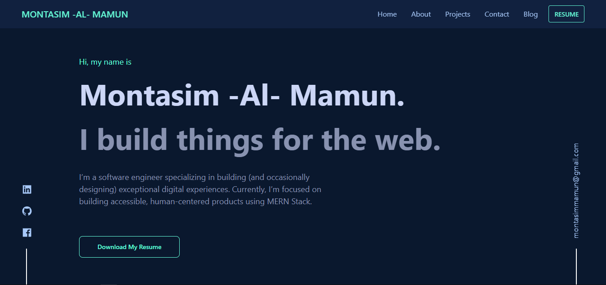

<h1 align="center">
  montasim-dev.web.app 
</h1>
<p align="center">
  My personal website - <a href="https://montasim-dev.web.app/" target="_blank">montasim-dev.web.app</a> built with <a href="https://reactjs.org/" target="_blank">React</a> and hosted with <a href="https://firebase.google.com/" target="_blank">Firebase.</a>
</p>



## Forking this repo (please read!)

Yes, you can fork this repo. Please give me proper credit by linking back to [montasim-dev.web.app](https://montasim-dev.web.app/). Thanks!

## 🛠 Installation & Set Up

1. Install the packages

   ```sh
   npm install
   ```

2. Start the development server

   ```sh
   npm start
   ```

## 🚀 Building and Running for Production

1. Generate production build

   ```sh
   npm run build
   ```

2. Preview the site once deployed (using Firebase)

   ```sh
   firebase deploy
   ```

## 🎨 Color Reference

| Color          | Hex                                                                |
| -------------- | ------------------------------------------------------------------ |
| Navy           |  `#0a192f` |
| Light Navy     |  `#112240` |
| Lightest Navy  |  `#233554` |
| Slate          |  `#8892b0` |
| Light Slate    |  `#a8b2d1` |
| Lightest Slate |  `#ccd6f6` |
| White          |  `#e6f1ff` |
| Green          |  `#64ffda` |

<br>
<br>

<!-- 𝙲𝚘𝚗𝚗𝚎𝚌𝚝 𝚆𝚒𝚝𝚑 𝙼𝚎  -->
<h2 align="right"><b> 🔸 Ｆｉｎｄ Ｍｅ Ｏｎ Ｓｏｃｉａｌ Ｍｅｄｉａ  </b></h2>

[//]: # "handshake gif"


 
<br>
<br>
<br>

<table align="right">
    <thead>
        <tr>
            <th align="center"><a href="https://www.linkedin.com/in/montasim"></a></th>
	        <th align="center"><a href="https://www.github.com/montasim"></a></th>
            <th align="center"><a href="https://stackoverflow.com/users/10429621/coderaid"></a></th>
            <th align="center"><a href="https://montasim-dev.web.app/"></a></th>
            <th align="center"><a href="mailto:montasimmamun@gmail.com"></a></th>
            <th align="center"><a href="https://twitter.com/montasimmamun"></a></th>
            <th align="center"><a href="https://www.facebook.com/montasimmamun/"></a></th>
        </tr>
    </thead>
</table>
<!-- end Connect With Me -->
